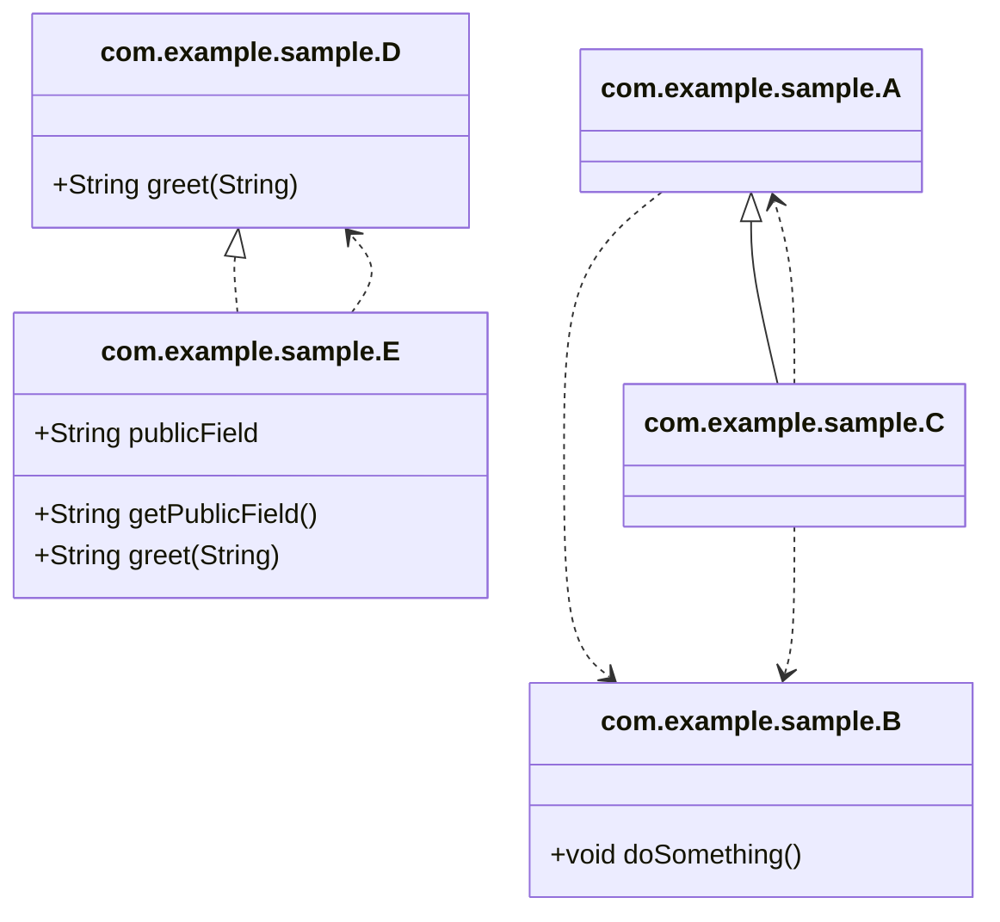

# Code Atlas Gradle Plugin
README [English](README.md) [Japanese](README_JA.md)
 
## Overview

The **Code Atlas** Gradle plugin analyzes compiled Java classes of a project and generates class diagrams in two formats:
- **PlantUML** (`.puml`)
- **Mermaid** (`.mmd`)

It is useful for visualising architecture, dependencies, inheritance and interface implementations.

## Usage

1. **Apply the plugin** in your `build.gradle.kts` (or `build.gradle`):
   ```kotlin
   plugins {
       id("com.euledge.codeatlas") version "1.0.0"
   }
   ```
2. **Configure the extension** (optional):
   ```kotlin
   codeAtlas {
       formats.set(listOf("plantuml", "mermaid"))
       outputDir.set("docs/diagrams")
       rootPackage.set("com.example") // Optional: filter classes by package prefix
   }
   ```
   - `formats` – list of diagram formats to generate.
   - `outputDir` – directory where the diagram files will be written.
   - `rootPackage` – optional package prefix to filter classes for analysis. Only classes starting with this prefix will be included.
3. **Run the task**:
   ```sh
   ./gradlew generateDiagrams
   ```
   The task will compile the project (if needed), scan the compiled classes and create the diagram files under the configured output directory.

### Command Line Configuration

You can override extension properties using Gradle project properties (`-P` or `--project-prop`).

Note: When passing properties with dots (e.g., `rootPackage=com.example`), using `--project-prop` is recommended to avoid command line parsing issues, especially on Windows.

| Property Name | Example Value | Description |
|---|---|---|
| `formats` | `plantuml,mermaid` | Comma-separated list of formats. |
| `outputDir` | `reports/diagrams` | Output directory path. |
| `rootPackage` | `com.example` | Package prefix to filter classes. |
| `showDetails` | `true` or `false` | If true, includes public fields and methods in the diagram. (Default: `false`) |

Example usage for all parameters:
```sh
./gradlew generateDiagrams \
    --project-prop formats=plantuml,mermaid \
    --project-prop outputDir=reports/diagrams \
    --project-prop rootPackage=com.example \
    --project-prop showDetails=true
```
Alternatively, on Windows, you might need to use double quotes with `-P`:
```sh
./gradlew generateDiagrams -P"formats=plantuml,mermaid" -P"outputDir=reports/diagrams" -P"rootPackage=com.example" -P"showDetails=true"
```

## Sample Project

A minimal sample project is provided under `sample-project`. After publishing the plugin to your local Maven repository (`./gradlew publishToMavenLocal`), you can run:
```sh
cd sample-project
../gradlew generateDiagrams
```
The generated diagrams will be placed in `sample-project/docs/diagrams`.

## Generated Diagram Example (Mermaid)



## Requirements

- Java 21 (or compatible JDK)
- Gradle 8.5 or newer
- The plugin uses **ClassGraph** for classpath scanning.

## License

[MIT License](LICENSE.md)
