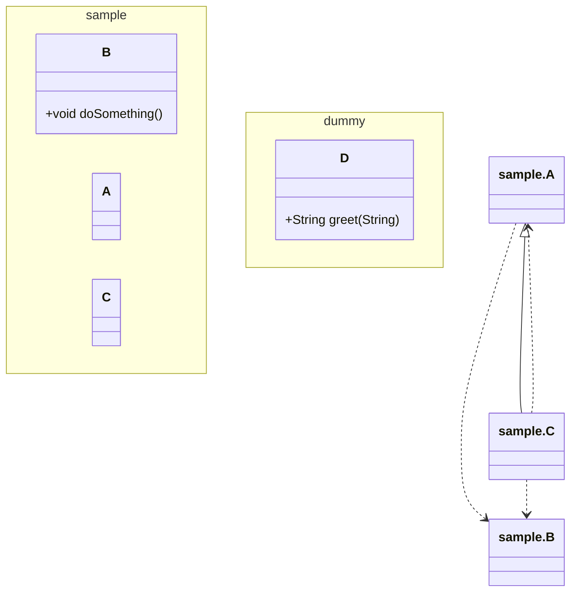

# Code Atlas Gradle Plugin

[](https://github.com/euledge/code-atlas/actions/workflows/ci.yml)

README [English](README.md) [Japanese](README_JA.md) | [Release Notes](docs/RELEASE_NOTES.md)
 
## Overview

The **Code Atlas** Gradle plugin analyzes compiled Java classes of a project and generates class diagrams in two formats:
- **PlantUML** (`.puml`)
- **Mermaid** (`.mmd`)

It is useful for visualising architecture, dependencies, inheritance and interface implementations.

**Note**: Synthetic classes, inner classes, and anonymous inner classes are excluded from the analysis.

## Usage

1. **Configure repositories** in your `settings.gradle.kts` (or `settings.gradle`):
   <details>
   <summary>Kotlin DSL (settings.gradle.kts)</summary>

   ```kotlin
   pluginManagement {
       repositories {
           gradlePluginPortal()
           mavenCentral()
       }
   }
   ```
   </details>

   <details>
   <summary>Groovy DSL (settings.gradle)</summary>

   ```groovy
   pluginManagement {
       repositories {
           gradlePluginPortal()
           mavenCentral()
       }
   }
   ```
   </details>

2. **Apply the plugin** in your `build.gradle.kts` (or `build.gradle`):
   ```kotlin
   plugins {
       id("io.github.euledge.code-atlas") version "1.1.0"
   }
   ```
3. **Configure the extension** (optional):
   <details>
   <summary>Kotlin DSL (build.gradle.kts)</summary>

   ```kotlin
   codeAtlas {
       formats.set(listOf("plantuml", "mermaid"))
       outputDir.set("docs/diagrams")
       rootPackages.set(listOf("com.example.domain", "com.example.infrastructure")) // Optional: filter classes by package prefixes
       showDetails.set(true) // Optional: include public fields and methods in the diagram
       stripPackagePrefix.set("com.example.") // Optional: strip common package prefix from class names
       groupByPackage.set(true) // Optional: group classes by package using namespace/package syntax
   }
   ```
   </details>

   <details>
   <summary>Groovy DSL (build.gradle)</summary>

   ```groovy
   codeAtlas {
       formats = ['plantuml', 'mermaid']
       outputDir = 'docs/diagrams'
       rootPackages = ['com.example.domain', 'com.example.infrastructure'] // Optional: filter classes by package prefixes
       showDetails = true // Optional: include public fields and methods in the diagram
       stripPackagePrefix = 'com.example.' // Optional: strip common package prefix from class names
       groupByPackage = true // Optional: group classes by package using namespace/package syntax
   }
   ```
   </details>
   
   - `formats` – list of diagram formats to generate.
   - `outputDir` – directory where the diagram files will be written.
   - `rootPackages` – optional list of package prefixes to filter classes for analysis. Only classes starting with these prefixes will be included. Useful for DDD architectures (e.g., `listOf("com.example.domain", "com.example.infrastructure")`).
   - `showDetails` – optional flag to include public fields and methods in the diagram. Default is `false`.
   - `stripPackagePrefix` – optional common package prefix to remove from class names for cleaner diagrams. Default is `""`.
   - `groupByPackage` – optional flag to group classes by their package. Default is `false`.

4. **Run the task**:
   ```sh
   ./gradlew generateDiagrams
   ```
   The task will compile the project (if needed), scan the compiled classes and create the diagram files under the configured output directory.
   To see more detail about the options, run:
   ```sh
   ./gradlew help --task generateDiagrams
   ```


### Command Line Configuration

You can override extension properties using Gradle project properties (`-P` or `--project-prop`).

Note: When passing properties with dots (e.g., `rootPackages=com.example.domain,com.example.infrastructure`), using `--project-prop` is recommended to avoid command line parsing issues, especially on Windows.

| Property Name | Example Value | Description |
|---|---|---|
| `formats` | `plantuml,mermaid` | Comma-separated list of formats. |
| `outputDir` | `reports/diagrams` | Output directory path. |
| `rootPackages` | `com.example.domain,com.example.infrastructure` | Comma-separated list of package prefixes to filter classes. |
| `showDetails` | `true` or `false` | If true, includes public fields and methods in the diagram. (Default: `false`) |
| `stripPackagePrefix` | `com.example.` | Package prefix to strip. |
| `groupByPackage` | `true` or `false` | Whether to group classes by package. |

Example usage for all parameters:
```sh
./gradlew generateDiagrams \
    --project-prop formats=plantuml,mermaid \
    --project-prop outputDir=reports/diagrams \
    --project-prop rootPackages=com.example.domain,com.example.infrastructure \
    --project-prop showDetails=true \
    --project-prop stripPackagePrefix=com.example. \
    --project-prop groupByPackage=true
```
Alternatively, on Windows, you might need to use double quotes with `-P`:
```sh
./gradlew generateDiagrams -P"formats=plantuml,mermaid" -P"outputDir=reports/diagrams" -P"rootPackages=com.example.domain,com.example.infrastructure" -P"showDetails=true" -P"stripPackagePrefix=com.example." -P"groupByPackage=true"
```

## Sample Project

A minimal sample project is provided under `sample-project`. After publishing the plugin to your local Maven repository (`./gradlew publishToMavenLocal`), you can run:
```sh
cd sample-project
../gradlew generateDiagrams
```
The generated diagrams will be placed in `sample-project/docs/diagrams`.

## Generated Diagram Example (Mermaid)



## Requirements

- Java 21 (or compatible JDK)
- Gradle 8.5 or newer
- The plugin uses **ClassGraph** for classpath scanning.

## License

[MIT License](LICENSE.md)
