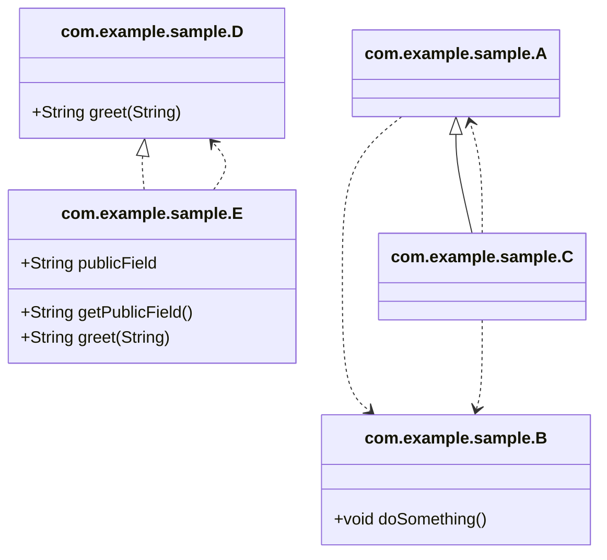

# Code Atlas Gradle プラグイン

[](https://github.com/euledge/code-atlas/actions/workflows/ci.yml)

README [英語版](README.md) [日本語版](README_JA.md) | [リリースノート](docs/RELEASE_NOTES_JA.md)
 
## 概要

**Code Atlas** Gradle プラグインは、プロジェクトのコンパイル済み Java クラスを解析し、次の 2 つの形式でクラス図を生成します。
- **PlantUML**（`.puml`）
- **Mermaid**（`.mmd`）

アーキテクチャや依存関係、継承・インタフェース実装を可視化したいときに便利です。

**注意**: 解析対象から、合成クラス、内部クラス、および匿名内部クラスは除外されます。

## 使い方

1. **プラグインを適用**（`build.gradle.kts` または `build.gradle`）:
   ```kotlin
   plugins {
       id("io.github.euledge.code-atlas") version "0.9.0"
   }
   ```
2. **拡張設定**（任意）:
   ```kotlin
   codeAtlas {
       formats.set(listOf("plantuml", "mermaid"))
       outputDir.set("docs/diagrams")
       rootPackages.set(listOf("com.example.domain", "com.example.infrastructure")) // 任意: パッケージプレフィックスでクラスをフィルタリング
       showDetails.set(true) // 任意: 公開フィールドとメソッドを図に含める
   }
   ```
   - `formats` – 生成したい図のフォーマット一覧。
   - `outputDir` – 図ファイルを書き出すディレクトリ。
   - `rootPackages` – 解析対象のクラスをフィルタリングするための任意のパッケージプレフィックス。このプレフィックスで始まるクラスのみが含まれます。DDDアーキテクチャの場合、`listOf("com.example.domain", "com.example.infrastructure")`のような値を設定します。
   - `showDetails` – `true`の場合、公開フィールドとメソッドを図に含めます。（デフォルト: `false`）


3. **タスクを実行**:
   ```sh
   ./gradlew generateDiagrams
   ```
   タスクはプロジェクトをコンパイル（必要なら）し、クラスをスキャンして設定した出力ディレクトリに図を作成します。

### コマンドライン設定

Gradle プロジェクトプロパティ（`-P` または `--project-prop`）を使用して、拡張設定を上書きできます。

| プロパティ名 | 例 | 説明 |
|---|---|---|
| `formats` | `plantuml,mermaid` | カンマ区切りのフォーマット一覧。 |
| `outputDir` | `reports/diagrams` | 出力ディレクトリパス。 |
| `rootPackages` |  `com.example.domain,com.example.infrastructure` | カンマ区切りのパッケージプレフィックス一覧。 |
| `showDetails` | `true` または `false` | `true`の場合、公開フィールドとメソッドを図に含めます。（デフォルト: `false`） |

注意: ドット（例: `rootPackages=com.example`）を含むプロパティを渡す場合、特に Windows 環境でのコマンドライン解析の問題を避けるために、`--project-prop`の使用を推奨します。

すべてのパラメータの使用例:
```sh
./gradlew generateDiagrams \
    --project-prop formats=plantuml,mermaid \
    --project-prop outputDir=reports/diagrams \
    --project-prop rootPackages=com.example.domain,com.example.infrastructure \
    --project-prop showDetails=true
```
または、Windows では `-P` とダブルクォーテーションを使用する必要がある場合があります:
```sh
./gradlew generateDiagrams -P"formats=plantuml,mermaid" -P"outputDir=reports/diagrams" -P"rootPackages=com.example.domain,com.example.infrastructure" -P"showDetails=true"
```

## サンプルプロジェクト

`sample-project` ディレクトリに最小構成のサンプルがあります。プラグインをローカル Maven リポジトリに公開した後（`./gradlew publishToMavenLocal`）、以下を実行してください。
```sh
cd sample-project
../gradlew generateDiagrams
```
生成された図は `sample-project/docs/diagrams` に配置されます。

## 生成された図の例 (Mermaid)



## 前提条件

- Java 21（または互換性のある JDK）
- Gradle 8.5 以上
- クラスパススキャンに **ClassGraph** を使用しています。

## ライセンス

[MIT License](LICENSE.md)

